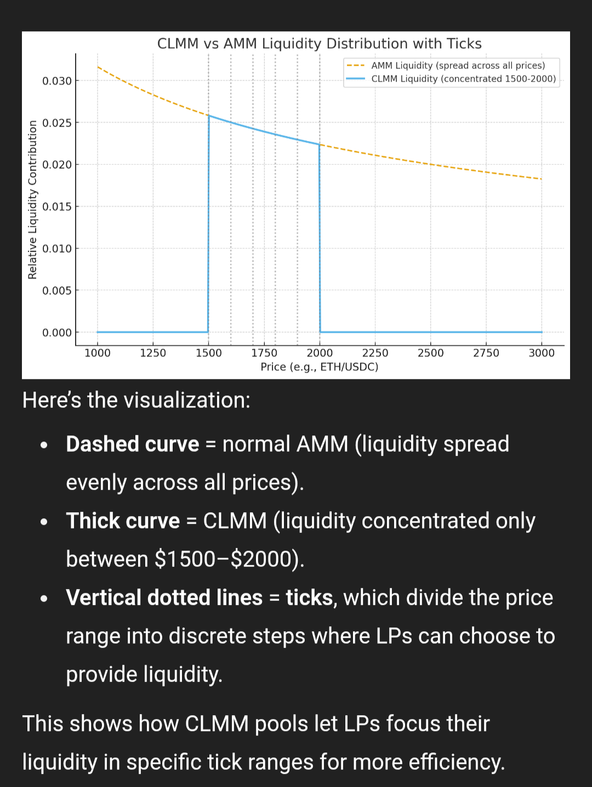

## Theory

This tick math is only involved in Concentrated liquidity AMMs for eg CLMM, orca whirlpoolliquidity providers deposit liquidity **within a chosen price range**.

- The range is represented by **ticks**, which are discrete steps along the price curve.
- Each tick corresponds to a **√price value**, and math around these ticks is needed to:
  - Track which range liquidity belongs to.
  - Calculate swap steps as the price crosses tick boundaries.
  - Manage positions and fee accrual within active ticks.

### Analogy for understanding

Enter the **tick array** 📦

- A **tick array** is like a little **box** that holds **88 ticks at once**.
- Each box covers a continuous range of prices.
- Example:
  - Box #1 → ticks 0 to 87
  - Box #2 → ticks 88 to 175
  - Box #3 → ticks 176 to 263
- The size of the steps (spacing between ticks) depends on the pool’s `tickSpacing`.

**Why do we need them in swaps?** When you swap:

- The pool price may **move** across ticks.
- To know how much liquidity is available at each price range, the program needs to **look inside the boxes (tick arrays)** that the price will pass through.
- So when you build a swap instruction, you must give it the **tick arrays (boxes)** that the price will touch.
  - If you swap a tiny amount, maybe it only stays inside one box.
  - If you swap a big amount, it might cross into several boxes, so you need to pass more tick arrays.

### Visualization

### Use case of CLMM:

The use case of CLMM is, basically you trade against a specified price range. The liquidity providers can concentrate their liquidity within specific price ranges rather than spreading it across the entire price spectrum

Main use cases will be :

- Higher yield for LPs: Since liquidity is focused, fees are earned more efficiently within active price ranges.
- Better execution for traders: Traders get lower slippage and deeper liquidity in the most relevant price zones.
- Efficient price movement tracking: Tick math allows the protocol to determine exactly when the pool price crosses from one range to another.
- Accurate liquidity accounting: By using ticks, the protocol can precisely manage liquidity positions, fee growth, and swap steps at each price boundary.
